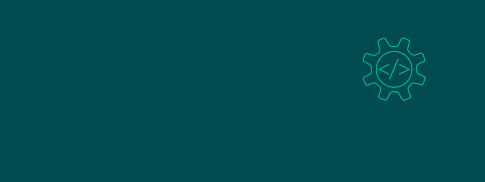

<h2> Hey there! I'm Mibei Collins👋.</h2>

<h3> 👨🏻‍💻 &nbsp;About Me </h3>

- 🤔 &nbsp; Exploring new technologies and developing software solutions and quick hacks.
- 🎓 &nbsp; Studying Information Technology at Kabarak University.
- 🌱 &nbsp; Learning more about Backend Architectures and Frontend Developement using NodeJS, ExpressJS, MongoDB and ReactJS.
- ✍️ &nbsp; Pursuing Competitive Programming.

<h3> 💻 &nbsp; Languages and Tools </h3>

&nbsp; &nbsp; &nbsp; &nbsp; &nbsp; 

 
&nbsp; &nbsp; &nbsp; &nbsp; &nbsp; 

<h3> 🤝🏻 &nbsp; Lets connect </h3>

&nbsp; &nbsp; &nbsp; &nbsp; &nbsp; 

